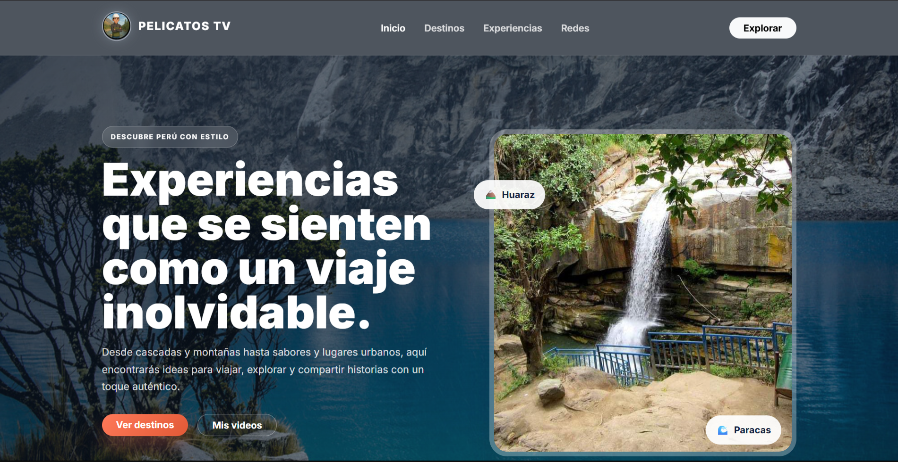

# 🎬 PelicatosTV

PelicatosTV es una página web enfocada en la presentación y exploración de contenido audiovisual, desarrollada como un proyecto web utilizando tecnologías frontend.

## 🌐 Demo

Puedes visitar la página desplegada en GitHub Pages:

👉 https://andyj189.github.io/PelicatosTV/

## 📌 Descripción

PelicatosTV es un proyecto web creado para practicar y demostrar conocimientos en desarrollo frontend, diseño de interfaces y programación con JavaScript.

La página presenta una interfaz orientada al contenido audiovisual, utilizando una estructura visual moderna, navegación entre secciones y elementos interactivos.

## 🚀 Características

- 🎬 Presentación de contenido audiovisual.
- 📱 Diseño adaptable a diferentes tamaños de pantalla.
- 🧭 Navegación entre las diferentes secciones.
- 🔎 Interacción mediante JavaScript.
- 🎨 Diseño personalizado con HTML y CSS.
- ⚡ Elementos dinámicos e interactivos.
- 🌐 Despliegue mediante GitHub Pages.

## 🛠️ Tecnologías utilizadas

- HTML5
- CSS3
- JavaScript
- Git
- GitHub
- GitHub Pages

## 📂 Estructura del proyecto

```text
PelicatosTV/
│
├── index.html
├── css/
│   └── style.css
│
├── js/
│   └── script.js
│
├── img/
│   └── ...
│
└── README.md


